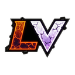
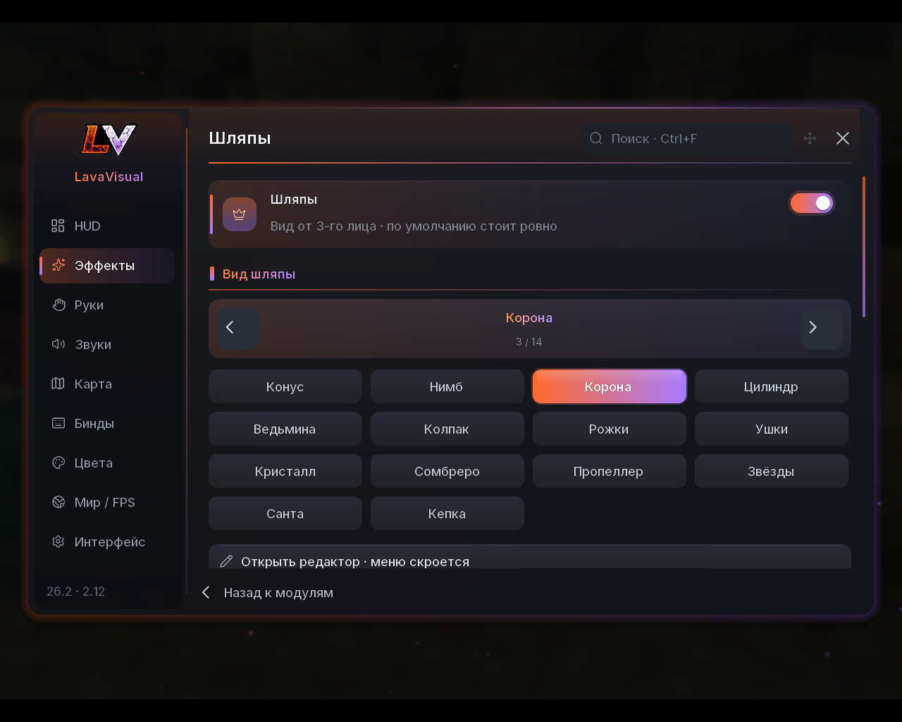
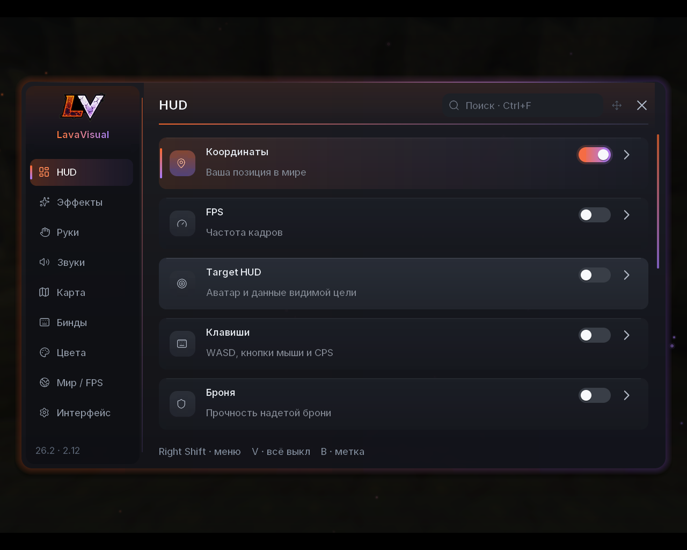
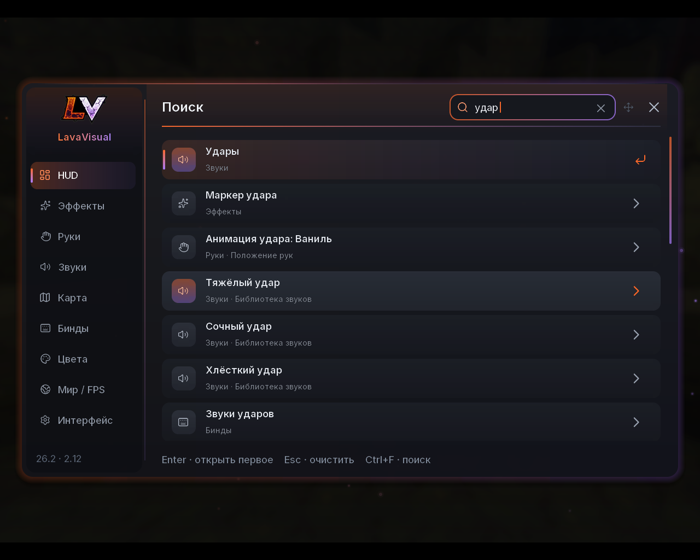
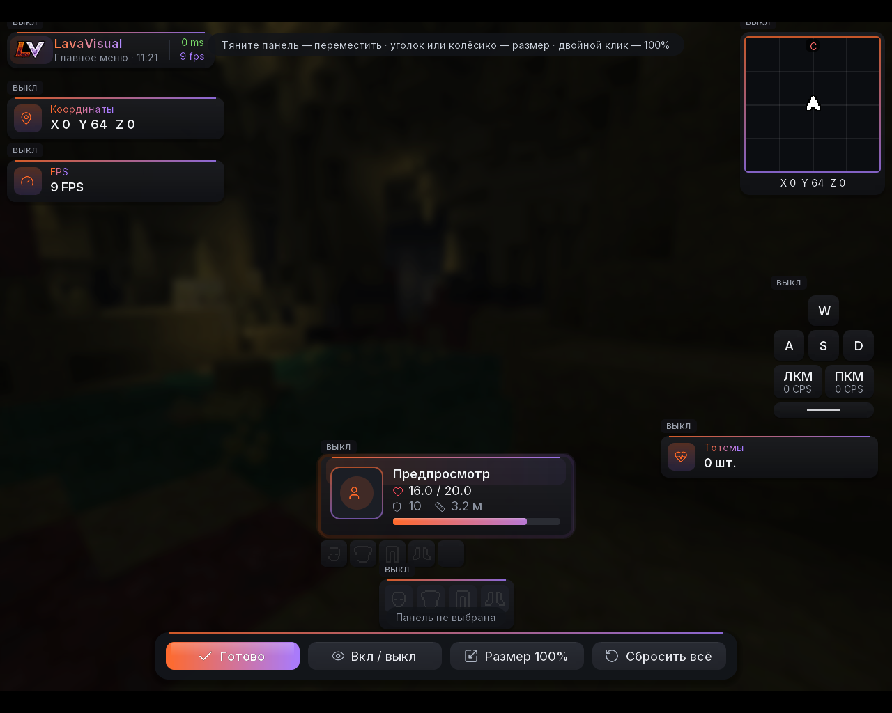
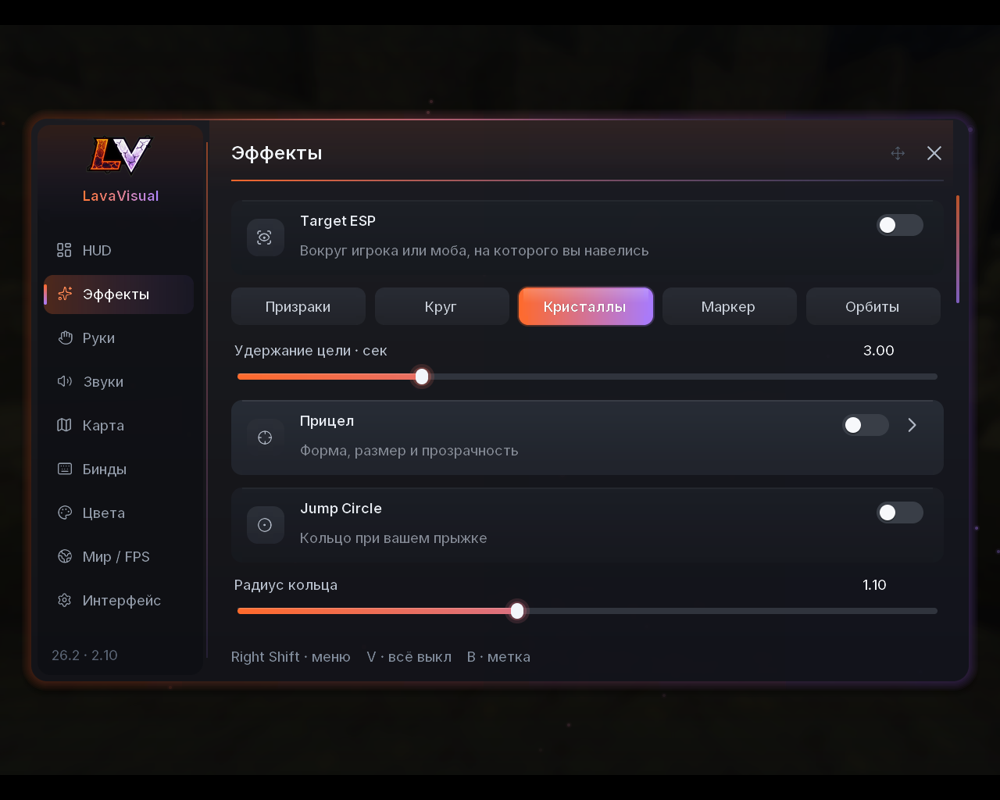

# LavaVisual 2.12.0 — Minecraft 26.2

**[Скачать lavavisual-2.12.0-mc26.2.jar](artifacts/lavavisual-2.12.0-mc26.2.jar)**

## Что нового в 2.12

- **Шляпы вместо China Hat — 14 моделей:** Конус, Нимб, Корона, Цилиндр, Ведьмина, Колпак, Рожки, Ушки, Кристалл,
  Сомбреро, Пропеллер, Звёзды, Санта, Кепка. Настоящие 3D-модели с освещением, свечением и анимацией (нимб и
  кристалл парят, пропеллер крутится). Выбор — «Эффекты» → «Шляпы» → стрелка: переключатель ‹ › и чипы со всеми
  видами; в редакторе шляпы тоже есть стрелки. Стили: «узор», «сплошной», «градиент»; «Высота шляпы» вытягивает
  модель. Модели описаны в `assets/lavavisual/hats.json` и собираются `tools/make_hats.py` (там же предпросмотр).
- **Шляпа успевает за головой.** Она ставится на голову той же модели игрока, которая рисуется в этом кадре
  (позиция, присед, поворот и наклон головы), поэтому больше не отстаёт при резких поворотах. В режиме «ровно»
  шляпа не наклоняется, но лежит на макушке так, как лежала бы настоящая: при взгляде вниз — на затылке. На шлеме
  шляпа садится выше, во сне и при полёте на элитрах прячется.
- **Шляпы других игроков LavaVisual** — видно, включена ли шляпа, какая и какого цвета. Без серверного мода:
  при включённом «Делиться значком и шляпой» (выключено по умолчанию) мод раз в секунду меняет невидимый бит 0x80 в
  настройках скина — сервер пересылает его всем как обычно. Кадр (~30 сек) уходит, только когда рядом есть игроки:
  после смены шляпы, при встрече игрока LavaVisual и изредка для обновления. Первые 10 секунд после входа бит не
  отправляется вовсе. Показ чужих шляп — «Шляпы других игроков» (включено).
- **Анимация удара без «провала».** С выбранным стилем удара рука больше не дёргается вниз на перезарядке: сам
  взмах длится столько, сколько перезаряжается предмет в руке (меч ≈ 0,6 с, топор ≈ 1 с, кулак — как у стиля).

## Что нового в 2.11

- **Без анимации перезарядки.** После удара оружие больше не опускается и не «поднимается» заново, пока идёт
  перезарядка атаки. Индикатор у прицела (линия под плюсом) остаётся ванильным. Анимация смены предмета сохранена.
  Переключатель — «Руки» → «Без анимации перезарядки» (включён по умолчанию). Сама перезарядка, урон и пакеты не
  меняются — это только отрисовка руки.
- **Поиск в меню.** Поле в шапке: нажмите на него, Ctrl+F или просто начните печатать. Ищет по всем вкладкам,
  переключателям, ползункам, кнопкам, цветам, биндам и названиям звуков; «ё» = «е», запрос в неправильной раскладке
  («ifkzgf») тоже находится. Enter — открыть первый результат, Esc — очистить. Выбранный пункт подсвечивается.
- **8 новых насыщенных звуков** (свой синтез, `tools/make_sounds.py`): удары «Сочный удар», «Мощный панч»,
  «Хлёсткий удар», «Глухой бум» и криты «Клинок», «Взрыв», «Молния», «Сияние». Слои: суб-удар, «тело», шумовой
  шлепок и треск, мягкое насыщение и короткая комната. Во вкладке «Звуки» они выбираются в один клик (чипы под
  «Удары» и «Криты»); всего в библиотеке 35 звуков. Если раньше был выбран «Свой файл», он остаётся выбранным.

## Что нового в 2.10

- **Вход на серверы.** Мод больше ничего не отправляет серверу: убран свой сетевой канал `lavavisual:tag`, а метка
  значка в настройках скина теперь выключена по умолчанию («HUD» → «Показывать мой значок», с предупреждением).
  Строгие анти-бот фильтры (часто стоят на русских серверах) могли отбрасывать клиента с нестандартными настройками
  скина. Значки других игроков по-прежнему видны.
- **Меню не моргает.** Переливание считается от накопленной фазы, а не от «время × скорость»: движение ползунка
  «Скорость переливания» больше не дёргает цвета, и нет скачка раз в ~17 минут.
- **Меню можно перетаскивать** за шапку или за логотип; двойной клик по шапке возвращает в центр. Место сохраняется.
- **China Hat не отстаёт.** Шляпа берёт позицию, присед и поворот головы из того же состояния, по которому рисуется
  модель игрока в этом кадре, поэтому идёт ровно с головой при беге, прыжках и приседе.
- **Размер HUD.** В редакторе HUD: тяните уголок выбранной панели или крутите колёсико над ней, двойной клик —
  100 %. Размер от 50 до 250 % шагом в полпикселя (шрифт и логотип есть и для полушагов, поэтому текст остаётся
  чётким). Привязка к центру и краям экрана, стрелки двигают на 1 пиксель. «Сбросить расположение HUD» сбрасывает и
  размеры.
- **Всё гладкое.** Скругления, кружки, ползунки и переключатели рисуются в экранных пикселях со сглаживанием
  (маленький атлас кругов), а не ступеньками по единицам интерфейса. Кнопки редакторов (HUD, руки, метки, шляпа) —
  свои, скруглённые, с градиентом темы вместо ванильных.
- **Частицы в воздухе** (вместо «Звёздной пыли»): светлячки, снег, звёзды, угольки или сердечки вокруг вас;
  количество, размер, радиус и скорость настраиваются. Пул без выделения памяти, число частиц снижается при низком FPS
  и в FPS Boost; снег не падает под крышу.
- **Логотип** — ваш оригинал (`tools/logo/`), с заполненной обводкой и чистыми краями; для каждого масштаба и
  полушага своя текстура.

## Что нового в 2.9.1

- **Target ESP — 5 видов:** «Призраки», «Круг», **«Кристаллы»** (светящиеся кристаллы вокруг цели, как на скриншоте),
  «Маркер» (вращающиеся дуги и ромб перед целью) и «Орбиты» (три наклонных кольца с искрами). Выбор — в «Эффекты»,
  сразу под переключателем. Цвета — из темы (градиент) или свой цвет «Target ESP» во вкладке «Цвета».
- ESP включается, когда вы навелись на игрока или моба (до 8 блоков, только если цель видна), и держится
  «Удержание цели» секунд. Больше не требует включённого Target HUD.

## Что нового в 2.9

- **Логотип LV.** Иконка мода в списке модов, логотип в шапке меню и в водянке. Текстура логотипа есть для каждого
  масштаба интерфейса (1–8), поэтому он такой же чёткий, как шрифт. Пересборка —
  `python3 tools/make_logo.py [картинка на тёмном фоне]`.
- **Темы-градиенты.** У темы теперь два цвета; новая тема по умолчанию «LavaVisual» — лавовый оранжевый → аметист,
  как на логотипе. Ещё 8 тем (Лава, Мята, Океан, Неон, Золото, Роза, Закат, Лёд) и «Второй цвет темы» в «Цветах».
  Свой цвет элемента получает парный оттенок для градиента автоматически. Старый конфиг с зелёной темой по умолчанию
  один раз переходит на новую тему; выбранные вручную темы и цвета не меняются.
- **Новый вид меню.** Мягкая тень и цветное свечение вокруг окна, плавное появление, искры на фоне, градиентные
  переключатели, ползунки, вкладки, заголовки разделов и полоса прокрутки, подсветка кнопок.
- **HUD.** Панели с градиентной линией сверху и объёмным фоном, Target HUD с градиентной полоской здоровья и
  обводкой аватара, нажатые клавиши — градиентом, рамка миникарты — в цветах темы.
- **Эффекты в мире** (Jump Circle, Trails, Target ESP, Kill Effect, China Hat) переливаются между двумя цветами темы
  вместо одного цвета и его светлой версии.
- **FPS.** Всё новое — обычная отрисовка интерфейса без шейдеров; искры в меню считаются по времени, без объектов,
  и выключаются вместе с «Анимациями». В мире новых вычислений нет.

## Что нового в 2.8

- **China Hat с редактором.** Цвет, размер, высота над головой, высота конуса, прозрачность,
  стиль (полосы/сплошной/градиент) и вращение. По умолчанию шляпа **стоит ровно** и не крутится;
  наклон вместе с головой включается отдельно. «Редактор шляпы» закрывает меню, временно
  включает вид от 3-го лица (спереди/сзади) и возвращает прежнюю камеру после «Готово».
- **Свой цвет у всего.** Новая вкладка «Цвета»: тема и отдельные цвета акцента меню, фона меню,
  фона HUD, каждого виджета (водянка, Target HUD, клавиши, броня, координаты, FPS, тотемы,
  миникарта), значка у ников, прицела, Jump Circle, искр, пыли, маркера, ESP, Kill Effect,
  шляпы, следа и меток. Для каждого — «как тема», «свой цвет» (оттенок/насыщенность/яркость,
  12 пресетов, HEX копировать/вставить) или «переливание». Цвет модуля есть и в его настройках.
- **Миникарта — только местность.** Никаких игроков, мобов и предметов (подходит для серверов,
  где это запрещено). Север сверху, стрелка — вы, метки на карте, координаты, 3 масштаба.
  Цвета — как у ванильных карт (затенение рельефа, глубина воды); в Незере — пол вашего уровня.
- **Метки.** Клавиша **B** открывает окно: название, **X**, **Y (высота)**, **Z** (заполнены
  текущей позицией) и цвет. Метка видна лучом света в мире и подписью «название · расстояние»;
  если она за экраном — стрелка у края. Список во вкладке «Карта»: скрыть, изменить, удалить.
  Хранятся отдельно для каждого сервера/мира и измерения в `config/lavavisual-hud/waypoints.json`.
- **Бинды.** Вкладка «Бинды»: меню, «выключить всё», поставить метку, список меток, миникарта и
  её масштаб, скрыть HUD, Target HUD, прицел, шляпа, ESP, след, искры, звуки, FPS Boost.
  Нажмите на клавишу и новую кнопку (Esc — отмена, Backspace — удалить, можно кнопки мыши 3–8).
  Это обычные бинды Minecraft: они же есть в «Управление», работают с экранными кнопками лаунчеров.
- **FPS.** Всё новое выключено по умолчанию. Миникарта обновляет ≤256 столбцов за тик (с FPS Boost —
  128, в Незере втрое меньше) и загружает текстуру не чаще 5 раз в секунду; метки — один проход.

Клиентский HUD и косметика. Тёмное меню с гладким шрифтом Inter,
анимированными вкладками и переключателями; общий RGB-цвет, масштаб и
прозрачность настраиваются прямо в интерфейсе.

## Установка

Удалите прежний JAR LavaVisual из `mods`, установите новый. Требуются Minecraft
**26.2**, Fabric Loader **0.19.3+**, Fabric API **0.161.0+26.2** и Java **25+**.

Все модули **изначально выключены**. При первом переходе со старых версий
переключатели однократно выключаются; расположение HUD сохраняется. Секундомер,
уведомления и старые цветовые пресеты удалены.

## Меню и управление

**Right Shift** — меню (повторное нажатие закрывает). **V** — выключить все модули.
**B** — поставить метку. Всё переназначается во вкладке «Бинды». Колёсико мыши прокручивает
длинные страницы; ползунки работают перетаскиванием, запись на диск — после
отпускания. Масштаб меню 0.6–1.2 и прозрачность 25–100% — во вкладке «Интерфейс»;
интерфейс дополнительно сам уменьшается на небольших экранах и не ломается.

| Вкладка | Возможности |
| --- | --- |
| HUD | Водянка, координаты, FPS, Target HUD с 3D-аватаром и экипировкой, клавиши (WASD/ЛКМ/ПКМ/CPS/пробел), броня с прочностью, тотемы. Стрелка — размер, фон, удержание цели. |
| Эффекты | Прицел; Jump Circle; искры ручной атаки; звёздная пыль; маркер удара (круг или квадрат в центре цели, 1–3 с). |
| Руки | X, Y, Z и масштаб каждой руки; кнопка «Редактировать в игре» открывает полноэкранный редактор с видимыми руками. |
| Звуки | 27 встроенных звуков для ударов, критов, тотема и убийства плюс свои .ogg из папки; громкости и «Слушать». |
| Карта | Миникарта (только местность), масштаб, координаты; лучи и подписи меток; список меток текущего мира. |
| Бинды | 15 действий, захват клавиши или кнопки мыши, подсветка конфликтов, сброс. |
| Цвета | Тема и отдельный цвет (свой / как тема / переливание) для меню, фонов, каждого виджета и эффекта. |
| Мир / FPS | Редактор неба с готовыми пресетами (закат, неон, изумруд, алый, бездна) и FPS Boost (тихий: дальность ≤12, частицы «уменьшенные», без теней сущностей) с возвратом прежних значений. |
| Интерфейс | Масштаб/непрозрачность меню, затемнение мира, тени, анимации, конфиги 1–5, экспорт/импорт. |

### Руки

X/Y: −1…1; Z: −0.5…1.5; масштаб: 0.4…1.8. Положительный Z отдаляет руку/предмет
от камеры. Это **только преобразование изображения**, не дальность атаки, не
хитбоксы и не изменение взаимодействий. Полноэкранный редактор закрывает меню и
показывает результат сразу.

### Косметические эффекты

- Кольцо на месте собственного прыжка, радиус 0.5–2.
- Искры при ручном ударе по видимой живой цели под ванильным прицелом; это
  эффект нажатия атаки, **не подтверждение урона сервером**.
- Комбо-счётчик собственных последовательных ударов в Target HUD.
- China Hat (вращающаяся полосатая шляпа, вид от 3-го лица) и Trails (светящийся след) —
  идеи взяты из популярных визуалов (Magic Visuals, Phantom Visuals, Soup Visuals).
- 2.6 (по мотивам топовых открытых визуалов): анимации удара (Плавный/Быстрый/Резкий/Мягкий/
  Размах/Рубящий), Low Fire, пресеты рук и тем, Target ESP «призраки»/«кольцо» (только видимая цель),
  частицы-звёзды/сердечки с разлётом взрыв/кольцо/фонтан, Kill Effect, в Target HUD — вспышка урона,
  частицы из аватара и иконки брони/оружия цели.
- Счётчик тотемов (HUD). Jump Circle: волна с бегущим градиентом и вторым «эхо»-кольцом.
- Конфиги: 5 слотов с датой сохранения, экспорт/импорт текстом через буфер обмена,
  кнопка «Открыть папку конфигов».
- Значок LavaVisual рядом с ником игроков с модом — работает на обычных серверах без
  серверной части: мод ставит неиспользуемый бит 0x80 в настройках частей скина, сервер
  сам рассылает его другим игрокам (обычные клиенты его не рисуют). Отдельные
  серверы/прокси могут этот бит обнулять. Выключается в HUD → «Значок LavaVisual».
- Встроенная коррекция «дробящего» колеса мыши: одиночные выбросы в обратную
  сторону гасятся; всегда включена, без пункта в меню.
- Маркер удара — круг или квадрат в центре последней видимой цели, горит 1–3 с,
  форма/длительность/размер настраиваются; как и остальные эффекты, не виден
  сквозь блоки и не подсвечивает игроков сквозь текстуры.
- Звёздная пыль — декоративные огоньки вокруг своего игрока, не метки сущностей.
- Проверка глубины как у ванильной геометрии, без записи глубины. Нет ESP,
  Chams, трассеров и перебора сущностей мира.
- Ограниченные количества (до 4 колец, 96 искр, 6 маркеров) и очистка при смене
  мира; в отрисовку передаются снимки без ссылок на сущности/мир.

### Звуки

Встроены шесть эффектов **Kenney (CC0)**: мягкий/тяжёлый удар, металл/аркада для
крита, колокольчик/Power Up для тотема. Заменяются ванильные события, включая
слышимые события других игроков; сохраняются позиция, категория, тон и затухание.
Свои звуки: положите `.ogg` в `config/lavavisual-hud/sounds`, в меню «Звуки»
нажмите «обновить» — появится вариант «Свой» для каждого типа. Файлы подключаются
локальным ресурс-паком `LavaVisual Sounds` и работают только у вас.

### Небо и FPS Boost

Редактор неба смешивает выбранный оттенок с обычным цветом неба (0–100%); это
локальная подкраска, не изменение времени суток и не серверная механика.
FPS Boost — добровольный пресет: дальность прорисовки не выше 8 чанков, частицы
«минимально», тени сущностей выключены; прежние значения запоминаются и
возвращаются при выключении. Прирост зависит от системы и не обещается.
Дополнительно действует незаметная адаптация собственных эффектов: при низком FPS
LavaVisual сам снижает число частиц и сегментов, не трогая настройки игры.

## Target HUD

Показывает имя, HP/max HP, броню и расстояние для текущей живой цели под
ванильным прицелом (видимость и не больше 6 блоков). Для игроков — голова скина,
для мобов — их модель; если цель потеряна, панель держит последние данные
настроенное время (0.5–10 с, по умолчанию 3) и затем гаснет. Собственный игрок,
невидимые и наблюдатели исключены; поиска или запоминания игроков нет.

Сервер может не передавать реальное здоровье других игроков: точность удалённого
HP не гарантируется. Автоматизации атак, инвентаря и применения предметов нет.
**Даже косметика и Target HUD могут требовать отдельного разрешения администрации
сервера** — отсутствие ESP не равно одобрению.

## Настройки, сборка и проверки

Настройки: `config/lavavisual-hud/hud.json`, свои звуки:
`config/lavavisual-hud/sounds/`. Для полного сброса закройте игру и удалите файл.

С JDK 25: `./gradlew build` из корня или `ports/mc26.2`. CI выполняет сборку,
тесты конфигурации/миграции/границ, проверку состава JAR и запуск клиента с
Loader 0.19.3 под Xvfb: открываются все вкладки, настройки, редакторы HUD и рук,
прогон замены звуков. Это **не проверка игрового мира**: визуальную корректность
колец, искр, маркеров, рук, моделей и звуков в реальной игре, а также
совместимость с шейдерами нужно проверять отдельно.

## Сторонний код и идеи

- Lucide Icons (ISC, © Lucide Icons and Contributors) — иконки, подмножество `lucide.ttf`;
  лицензия в `licenses/Lucide-ISC.txt`. Шрифты собираются `tools/build_fonts.py`.
- 21 звук синтезирован `tools/make_sounds.py` (собственная работа, MIT), без чужих сэмплов.
- Миникарта повторяет правила ванильных карт (оттенки ×180/220/255, затенение по высоте блока к северу,
  глубина воды) по описанию [Minecraft Wiki: Map item format](https://minecraft.wiki/w/Map_item_format);
  код свой. Цвета блоков берутся из самой игры (`MapColor`). Сущности на карту не выводятся вообще.
- Бинды — обычные `KeyMapping` игры; комбинации F3 + клавиша (B — хитбоксы, V — версия) не
  запускают действия LavaVisual ([список debug-клавиш](https://minecraft.wiki/w/Debug_hotkey)).

- PulseVisual (MIT, © 2026 PulseVisual contributors) — таблица пресетов анимации удара, функция
  огибающей и константы Low Fire адаптированы; текст лицензии в `licenses/PulseVisual-MIT.txt`.
- ThunderHack Recode (GPL-3.0) — только идеи эффектов (призраки ESP, Kill Effect, формы частиц);
  код не копировался, реализация своя. Читерские модули не переносились.
