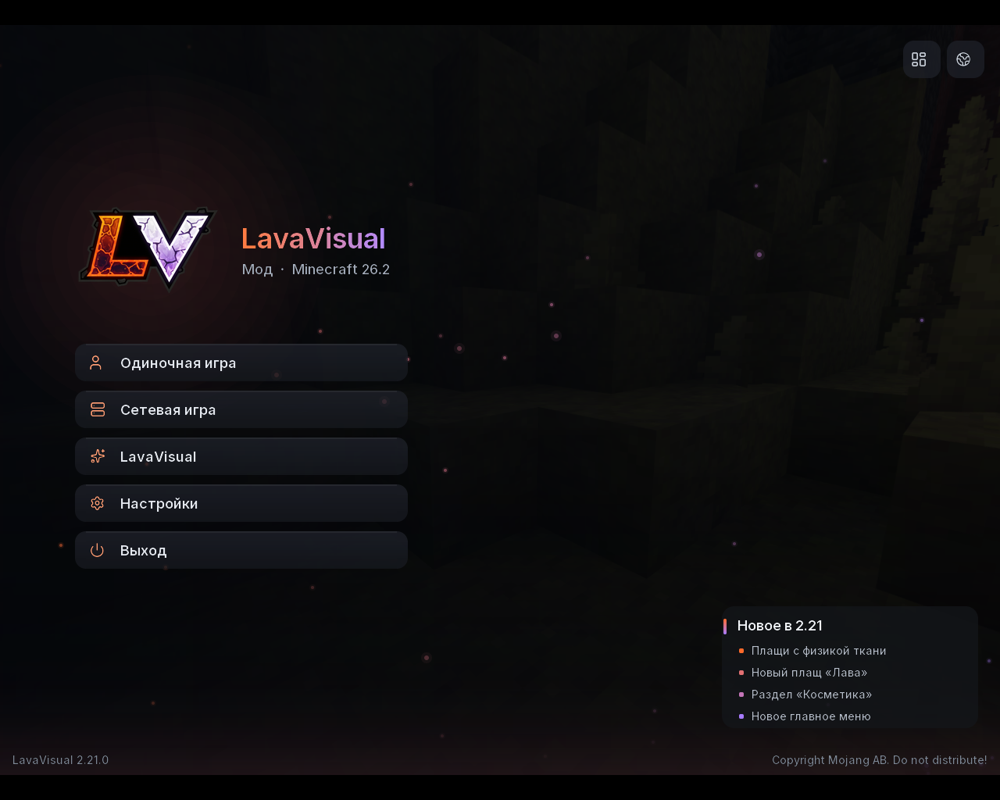
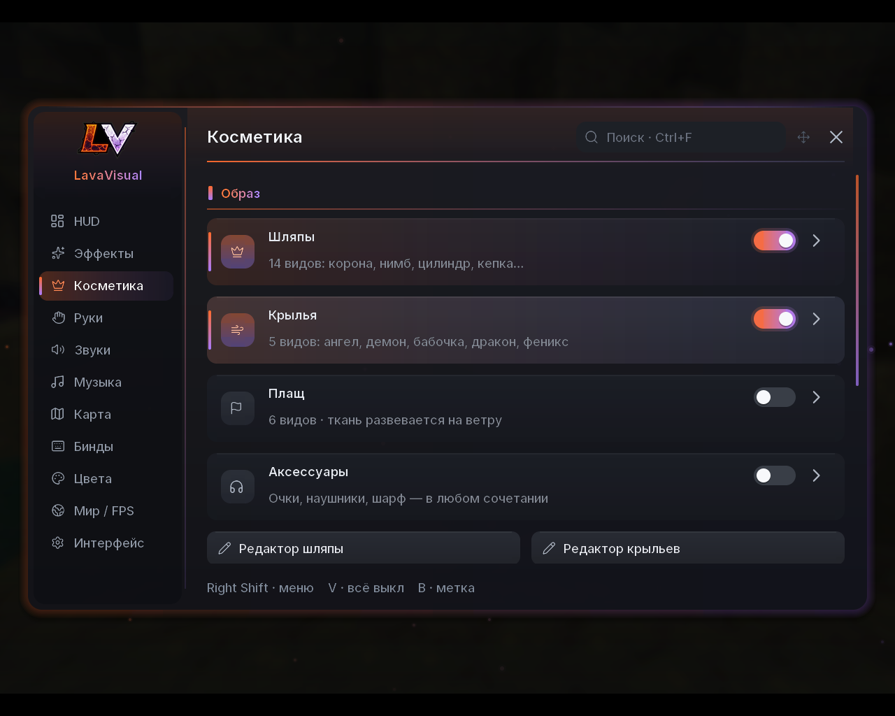
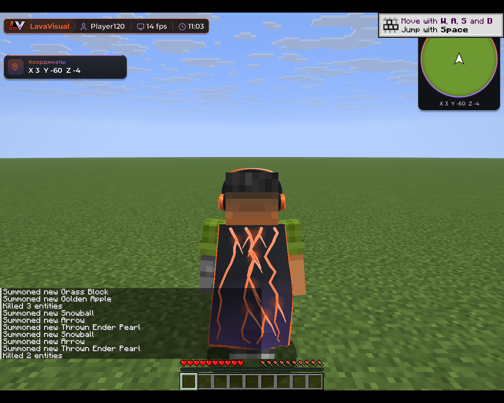
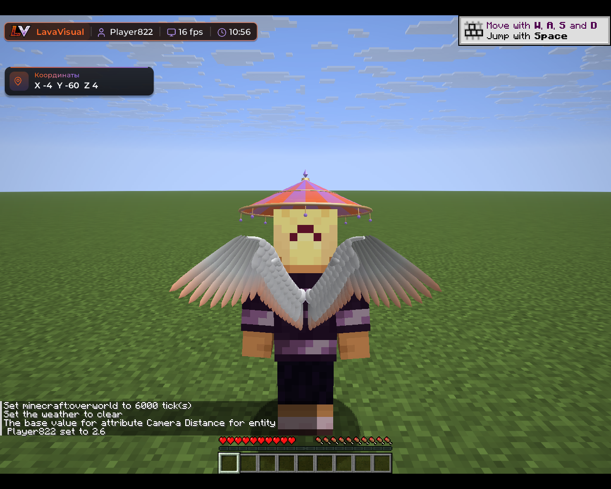

# LavaVisual — Minecraft 26.2


Клиентский визуальный мод для Fabric: HUD, косметика, эффекты, звуки, музыка и миникарта. Работает на обычных
серверах, серверная часть не нужна. Читерских функций нет.

| | Скачать | Что внутри |
| --- | --- | --- |
| **Мод** | [lavavisual-2.21.0-mc26.2.jar](artifacts/lavavisual-2.21.0-mc26.2.jar) | только LavaVisual, в папку `mods` |
| **Клиент** | [LavaVisual-Client-2.21.0-mc26.2.mrpack](artifacts/LavaVisual-Client-2.21.0-mc26.2.mrpack) | готовая сборка для Modrinth App, Prism Launcher, ATLauncher |
| **Клиент (архив)** | [LavaVisual-Client-2.21.0-mc26.2.zip](artifacts/LavaVisual-Client-2.21.0-mc26.2.zip) | папки `mods` и `config` для TLauncher и ручной установки |






## Установка

Minecraft **26.2**, Fabric Loader **0.19.3+**, Fabric API **0.161.0+26.2**, Java **25+**.

- **Мод:** положите JAR в папку `mods`, старую версию удалите.
- **Клиент:** импортируйте `.mrpack` в лаунчер — Fabric Loader и Fabric API поставятся сами. Для TLauncher
  распакуйте архив в `.minecraft` (инструкция внутри, `УСТАНОВКА.txt`). Клиент — тот же мод с окном
  «LavaVisual Client» и Fabric API в комплекте.

После первого запуска все модули выключены — включайте нужные в меню. Главное меню LavaVisual заменяет обычное;
вернуть обычное можно кнопкой в его правом верхнем углу или во вкладке «Интерфейс».

## Управление

| Клавиша | Действие |
| --- | --- |
| Right Shift | меню |
| M | музыкальный плеер |
| C | зум |
| Left Alt | свободный обзор |
| B | метка на карте |
| V | выключить все модули |

Все клавиши меняются во вкладке «Бинды», там же — клавиши плеера (пауза, треки, перемотка).

## Возможности

- **HUD:** водяной знак, Target HUD с аватаром, клавиши с CPS, броня, тотемы, координаты, музыка. Элементы
  перетаскиваются и меняют размер, шрифт HUD выбирается.
- **Косметика:** 14 шляп и 5 видов объёмных крыльев с редакторами (размер, положение, взмахи, цвет), 6 плащей с
  физикой ткани (развеваются от бега, прыжков и поворотов, с подкладкой), аксессуары (очки, наушники, шарф), следы.
  Шляпы и крылья видят другие игроки с LavaVisual.
- **Эффекты:** Target ESP, Jump Circle, частицы ударов, насыщенные криты, Kill Effect, маркер цели, частицы в воздухе.
- **Следы снарядов:** жемчуг, стрелы, трезубец, снежки, яйца, зелья, фейерверки и другое — выбор предметов, стиль,
  длина, ширина, цвет. Видно только вам.
- **Физика предметов:** выброшенные предметы кувыркаются в воздухе и ложатся на землю, настраивается.
- **Руки:** положение, поворот и масштаб каждой руки, анимации удара, редактор в игре.
- **Звуки:** встроенные звуки ударов, критов, тотема и убийства; свои файлы полностью заменяют ванильные.
- **Музыка:** плеер с обложками, перемоткой, повтором и перемешиванием.
- **Миникарта:** только местность, без игроков и мобов; метки с лучами.
- **Своё время суток** (только у вас), **небо** с пресетами, **FPS Boost** с четырьмя уровнями, темы и отдельный цвет для каждого элемента, 5 слотов
  конфигов с экспортом и импортом.

## Папки

Всё лежит в `config/lavavisual-hud/`:

- `hud.json` — настройки (удалите файл при закрытой игре, чтобы сбросить всё);
- `sounds/hits`, `crits`, `totems`, `kills` — свои звуки для каждого события, файлы в самой `sounds` видны везде;
- `music` — треки для плеера, обложка берётся из файла или из картинки рядом с тем же именем.

Форматы: **.mp3, .ogg (Vorbis и Opus), .opus, .wav**. Формат определяется по содержимому, имя может быть любым.
Файлы можно просто перетащить в окно игры.

## Сборка

```
./gradlew build
```

Нужен JDK 25. CI собирает мод, прогоняет тесты и запускает клиент: проверяет меню, главное меню, мир, физику плаща,
звук, музыку всех форматов и стоимость миникарты, а скриншоты кладёт в `artifacts/`. Пакеты клиента собирает
`tools/make_client.py`.

## Сторонние материалы

- [Lucide](https://lucide.dev) — иконки (ISC), `licenses/Lucide-ISC.txt`.
- [Inter](https://rsms.me/inter/), Montserrat, Rubik — шрифты (SIL OFL 1.1), `licenses/Inter-OFL.txt`.
- [Kenney](https://kenney.nl) — шесть звуков (CC0), `licenses/Kenney-CC0.txt`; остальные звуки синтезированы
  `tools/make_sounds.py`.
- [JavaMP3](https://github.com/delthas/JavaMP3) — декодер MP3 (MIT), `licenses/JavaMP3-MIT.txt`.
- [Concentus](https://github.com/lostromb/concentus) — декодер Opus (BSD), `licenses/Concentus-BSD.txt`.
- [Fabric API](https://github.com/FabricMC/fabric) — входит в пакеты клиента (Apache-2.0), лицензия лежит в архиве.
- PulseVisual (MIT) — пресеты анимации удара и Low Fire, `licenses/PulseVisual-MIT.txt`.
- Цвета миникарты следуют правилам ванильных карт ([Minecraft Wiki](https://minecraft.wiki/w/Map_item_format)).

Лицензия проекта — MIT, см. `LICENSE`.
