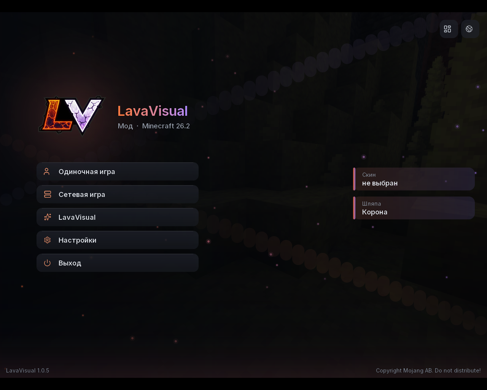
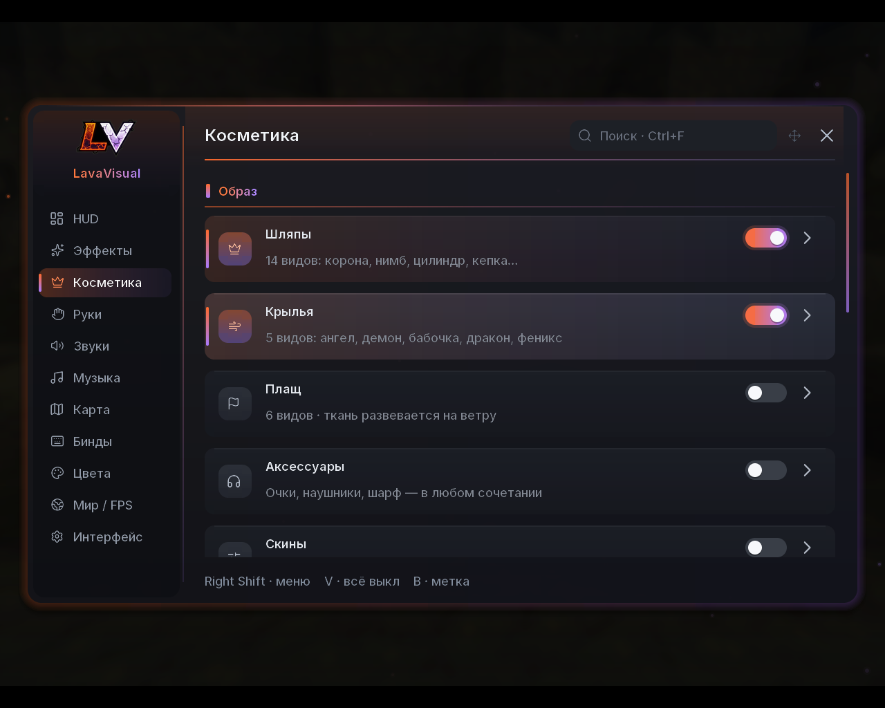
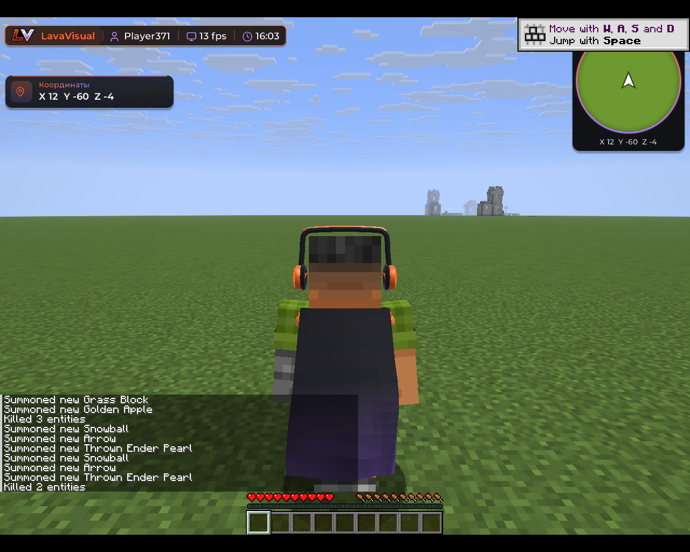
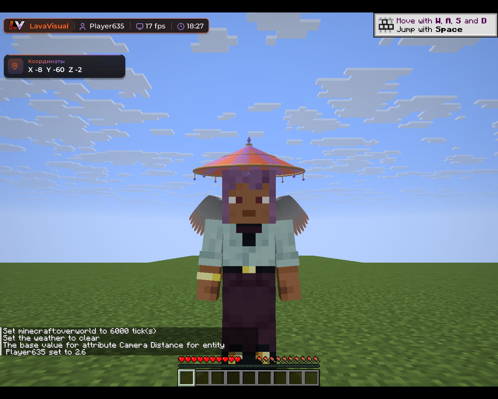

# LavaVisual 1.0.0 — Minecraft 26.2


Клиентский визуальный мод для Fabric: HUD, косметика, эффекты, звуки, музыка и миникарта. Работает на обычных
серверах, серверная часть не нужна. Читерских функций нет. Идёт на компьютере и на телефоне.

| | Скачать | Что внутри |
| --- | --- | --- |
| **Мод** | [lavavisual-1.0.0-mc26.2.jar](artifacts/lavavisual-1.0.0-mc26.2.jar) | только LavaVisual, в папку `mods` |
| **Клиент** | [LavaVisual-Client-1.0.0-mc26.2.mrpack](artifacts/LavaVisual-Client-1.0.0-mc26.2.mrpack) | готовая сборка для Modrinth App, Prism Launcher, ATLauncher |
| **Клиент (архив)** | [LavaVisual-Client-1.0.0-mc26.2.zip](artifacts/LavaVisual-Client-1.0.0-mc26.2.zip) | папки `mods` и `config` для TLauncher, телефонов и ручной установки |

Контрольные суммы — в [SHA256SUMS](artifacts/SHA256SUMS).

**Что нового в 1.0.0:** радио вашего города — мод сам определяет город по IP и даёт станции ближайшего города каталога
(федеральные станции играют везде); круги досягаемости под каждым игроком, как в HitRange; радио и круги настраиваются
в меню. Хитбоксы по-прежнему ванильные, с настраиваемыми цветами и без дрожания.

**Bedrock:** игроки Bedrock видят аксессуары LavaVisual-игроков (очки, наушники, шарф), если на сервере стоит
расширение для Geyser — [LavaVisual-Bedrock-1.1.0.jar](artifacts/bedrock/LavaVisual-Bedrock-1.1.0.jar) в папку
`extensions` и пак [LavaVisual-Bedrock-Pack-1.0.0.mcpack](artifacts/bedrock/LavaVisual-Bedrock-Pack-1.0.0.mcpack) в
папку `packs`, подробности в
[bedrock/README.md](bedrock/README.md).

**Скины для Bedrock:** готовый пак с аксессуарами —
[LavaVisual-Skins-1.0.0.mcpack](artifacts/bedrock/LavaVisual-Skins-1.0.0.mcpack), 18 скинов, открывается прямо в
Minecraft Bedrock.

**Приложение для Bedrock (Android):** значок LV поверх игры с меню визуала, HUD и аксессуарами в виде пака скина —
[LavaVisual-1.0.0.apk](artifacts/bedrock-app/LavaVisual-1.0.0.apk), инструкция в
[bedrock-app/README.md](bedrock-app/README.md).






## Установка

Minecraft **26.2**, Fabric Loader **0.19.3+**, Fabric API **0.161.0+26.2**, Java **25+**.

- **Мод:** положите JAR в папку `mods`, старую версию удалите.
- **Клиент:** импортируйте `.mrpack` в лаунчер — Fabric Loader и Fabric API поставятся сами. Для TLauncher
  распакуйте архив в `.minecraft` (инструкция внутри, `УСТАНОВКА.txt`). Клиент — тот же мод с окном
  «LavaVisual Client» и Fabric API в комплекте.

После первого запуска все модули выключены — включайте нужные в меню. Главное меню LavaVisual заменяет обычное;
вернуть обычное можно кнопкой в его правом верхнем углу или во вкладке «Интерфейс».

## Телефоны

PojavLauncher, MojoLauncher, Amethyst и другие лаунчеры на основе Pojav:

1. Установите в лаунчере Fabric для 26.2 и запустите его один раз.
2. Скопируйте папки `mods` и `config` из архива клиента в папку игры (`.minecraft`) или импортируйте `.mrpack`,
   если лаунчер это умеет.
3. Меню открывается кнопкой **LavaVisual** в главном меню и в меню паузы. Списки листаются пальцем или полосой
   прокрутки справа.

На телефоне мод сам рисует свои эффекты чуть проще (меньше частиц и сегментов), настройки игры не трогает.
Косметика других игроков видна так же, как на компьютере.

## Управление

| Клавиша | Действие |
| --- | --- |
| Right Shift | меню (или кнопка «LavaVisual» в меню паузы) |
| M | музыкальный плеер |
| C | зум |
| Left Alt | свободный обзор |
| B | метка на карте |
| V | выключить все модули |

Все клавиши меняются во вкладке «Бинды», там же — клавиши плеера (пауза, треки, перемотка).

## Возможности

- **HUD:** водяной знак, Target HUD с аватаром, клавиши с CPS, броня, тотемы, координаты, музыка. Элементы
  перетаскиваются и меняют размер, шрифт HUD выбирается.
- **Прочность:** полосы прочности брони, снаряжения в Target HUD и предметов в хотбаре оформлены одинаково —
  скруглённая дорожка, градиент и блик; процент меняет цвет. Порог предупреждения настраивается (по умолчанию
  20 %): слот «дышит» красным, приходит подсказка с мягким звонком, а у повреждённого предмета в руке под
  прицелом видна полоса прочности. Всё это включается и выключается в настройках виджета брони.
- **Косметика:** 14 шляп и 5 видов объёмных крыльев с редакторами (размер, положение, взмахи, цвет), 6 плащей с
  физикой ткани (развеваются от бега, прыжков и поворотов, с подкладкой), аксессуары (очки, наушники, шарф), следы.
  Хвост шарфа раскачивается, крылья отводятся назад на бегу и приподнимаются в падении. Косметика не врезается в
  скин: очки и наушники сидят поверх второго слоя кожи и шлема, шарф — поверх куртки и нагрудника, плащ и крылья не
  заходят в спину.
  Шляпы, крылья, плащи и аксессуары видят другие игроки с LavaVisual — без серверного мода; смена доходит до них
  примерно за 15 секунд. У ников таких игроков — логотип LV, он же стоит в списке игроков (Tab) во всех трёх
  версиях — и у вас в том числе.
- **Меню:** главный экран, список серверов, выбор и создание мира оформлены в одном стиле LavaVisual — полосы в
  цветах темы, бегущий блик по верхней кромке, уголки по краям, тень снизу и знак с версией в углу. Ничего в самих
  экранах не перерисовывается поверх ванильных кнопок, только рамка вокруг. На главном экране — полосы-авроры,
  огоньки и свечение вокруг лого, а справа быстрые входы «Радио», «Редактор» и «LavaVisual»: что надето сейчас,
  главный экран больше не показывает.
- **Обзор в инвентаре:** модель в инвентаре рисуется чуть меньше и с запасом по краям, поэтому шляпа, крылья, плащ и
  аксессуары видны целиком, а не обрезанную половину.
- **Хитбоксы:** по умолчанию белая рамка, как в ванильном F3+B — без заливки и лишних полос; цвета для игроков,
  мобов и цели под прицелом свои, вид «контур / контур + заливка / углы», толщина линий, дальность 4–64 блока, режим
  «все / игроки / мобы» и свой бокс отдельно. Толщина одинакова на любом расстоянии, а рамки не дрожат при движении.
- **Хит-рейндж:** под прицелом одно число — расстояние от глаз до хитбокса цели (зелёное — достаёте, красное — нет).
  Круги досягаемости, как в [HitRange](https://github.com/uku3lig/hitrange): на земле под вами круг радиуса досягаемости,
  круги других игроков в радиусе 48 блоков становятся зелёными, когда они в вашей досягаемости. Вид — линия, кольцо
  (по умолчанию) или заливка; радиус — «атака 3», «блок 4.5» или свой; цвета меняются во вкладке «Цвета».
- **Эффекты:** Target ESP, Jump Circle, частицы ударов, насыщенные криты, Kill Effect, маркер цели, частицы в воздухе.
- **Следы снарядов:** жемчуг, стрелы, трезубец, снежки, яйца, зелья, фейерверки и другое — выбор предметов, стиль,
  длина, ширина, цвет. Видно только вам.
- **Физика предметов:** выброшенные предметы кувыркаются в воздухе и ложатся на землю, настраивается.
- **Руки:** положение, поворот и масштаб каждой руки, анимации удара, редактор в игре.
- **Звуки:** встроенные звуки ударов, критов, тотема и убийства; свои файлы полностью заменяют ванильные.
- **Музыка:** плеер с обложками, перемоткой, повтором и перемешиванием, свои файлы из папки `music`.
- **Радио вашего города:** мод определяет город по IP-адресу (сервис ipwho.is, не чаще раза в неделю; сохраняются
  только город, регион и координаты). Станции ближайшего города из каталога (в пределах 120 км) играют у вас; город
  можно выбрать вручную, кнопка «Определить город снова» и переключатель «Определять город по IP» — там же. Каталог —
  47 станций, каждый адрес проверен: Махачкала (19, студия Radio05 и республиканские станции), Москва, Санкт-Петербург,
  Серпухов, Хабаровск, Барнаул, Владикавказ, Тюмень, Петропавловск-Камчатский, Ростов-на-Дону, Новосибирск.
- **Федеральное радио:** разговорные Маяк, Вести FM, Радио России, Комсомольская правда, Говорит Москва, Радио Книга
  и музыкальные Европа Плюс, Дорожное, Ретро FM, Радио Шансон, Русский Рок, Русские Песни — играют в любом городе.
  Станция сообщает название передачи или песни — оно видно в плеере и в HUD. Свои станции добавляются строкой в
  `LavaVisual/radio.txt`, файл с примером создаётся сам, кнопка «Перечитать радио.txt» рядом.
- **Радио без интернета:** тринадцать станций LavaVisual — лоу-фай, тихий вечер, синтвейв, космос, чиптюн, фортепиано,
  эпик, джаз, техно, фолк, медитация, ретро-игра, драм-н-бейс. Музыка сочиняется на ходу, поэтому играет у всех; свои
  треки из папки `music` никуда не деваются.
- **Миникарта:** только местность, без игроков и мобов; метки с лучами.
- **Своё время суток** (только у вас), **небо** с пресетами, **FPS Boost** с четырьмя уровнями, темы и отдельный
  цвет для каждого элемента, 5 слотов конфигов с экспортом и импортом.
- **Быстрая загрузка:** ресурс-паки серверов подключаются так же быстро, как без мода.
- **Плавность:** музыка, обложки, звуки и модели загружаются в фоне и не подвешивают игру. Пинг в водяном знаке
  обновляется каждую секунду: это живое измерение, а не значение таблицы игроков, которое сервер пересчитывает раз в
  30 секунд. Если сервер завис, число сразу начинает расти.

## Папки

Свои звуки и музыка лежат в `.minecraft/LavaVisual/` (папки создаются при первом запуске):

- `sounds/hits`, `crits`, `totems`, `kills` — свои звуки для каждого события, файлы в самой `sounds` видны везде;
- `music` — треки для плеера, обложка берётся из файла или из картинки рядом с тем же именем.

На телефоне папку видно в файловом менеджере и в приложении «Файлы» → «Расположения» → лаунчер. Файлы из старой
папки `config/lavavisual-hud/` переносятся сами. Настройки — `config/lavavisual-hud/hud.json` (удалите файл при
закрытой игре, чтобы сбросить всё).

Форматы: **.mp3, .ogg (Vorbis и Opus), .opus, .wav**. Формат определяется по содержимому, имя может быть любым.
На компьютере файлы можно просто перетащить в окно игры.

## Сборка

```
./gradlew build
```

Нужен JDK 25. CI проверяет, что косметика не заходит в модель игрока (`tools/check_fit.py`), собирает мод, прогоняет
тесты и запускает клиент: проверяет меню, главное меню, мир, физику плаща, пинг,
перезагрузку ресурсов, звук, музыку всех форматов и стоимость миникарты, а скриншоты кладёт в `artifacts/`. Пакеты
клиента собирает `tools/make_client.py`.

Без Minecraft и Gradle под рукой пригодятся местные инструменты: `tools/check_java.py` разбирает все
`*.java` портов (грамматика tree-sitter) и ругается на синтаксис и на вызовы несуществующих членов `UiDraw`,
`UiFont`, `Icons`; `tools/preview_menu.py` рисует макет меню (`docs/menu-preview.png`) с теми же размерами и
декором, что и `ui/ClickGuiScreen.java`; `tools/preview_durability.py` рисует полосы прочности и предупреждение
о низкой прочности (`docs/durability-preview.png`) с геометрией `hud/HudRenderer.java`.
Нужны пакеты с PyPI: `tree-sitter tree-sitter-java` и `pillow`.

## Сторонние материалы

- [Lucide](https://lucide.dev) — иконки (ISC), `licenses/Lucide-ISC.txt`.
- [Inter](https://rsms.me/inter/), Montserrat, Rubik — шрифты (SIL OFL 1.1), `licenses/Inter-OFL.txt`.
- [Kenney](https://kenney.nl) — шесть звуков (CC0), `licenses/Kenney-CC0.txt`; остальные звуки синтезированы
  `tools/make_sounds.py`.
- [JavaMP3](https://github.com/delthas/JavaMP3) — декодер MP3 (MIT), `licenses/JavaMP3-MIT.txt`.
- [Concentus](https://github.com/lostromb/concentus) — декодер Opus (BSD), `licenses/Concentus-BSD.txt`.
- [Fabric API](https://github.com/FabricMC/fabric) — входит в пакеты клиента (Apache-2.0), лицензия лежит в архиве.
- PulseVisual (MIT) — пресеты анимации удара и Low Fire, `licenses/PulseVisual-MIT.txt`.
- [HitRange](https://github.com/uku3lig/hitrange) by uku3lig (MIT) — вид кругов досягаемости и их режимы: LINE, THICK,
  FILLED. Код написан заново, исходный код HitRange не скопирован.
- [ipwho.is](https://ipwho.is) — определение города по IP-адресу (запрос раз в неделю, только при включённой опции).
- Цвета миникарты следуют правилам ванильных карт ([Minecraft Wiki](https://minecraft.wiki/w/Map_item_format)).

Лицензия проекта — MIT, см. `LICENSE`.
