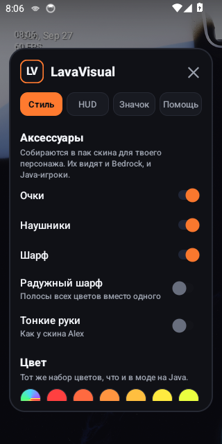

# LavaVisual для Minecraft Bedrock (Android)

Приложение-оверлей: значок **LV** висит поверх Minecraft и открывает меню визуала — как на Java, только пальцем.
Всё, что относится к Bedrock, лежит отдельно от Java-мода: этот проект не зависит от `ports/` и собирается своим Gradle.



## Установка

1. Скачай `LavaVisual-1.0.0.apk` из [`artifacts/bedrock-app/`](../artifacts/bedrock-app/).
2. Открой файл на телефоне. Android спросит разрешение ставить приложения из этого источника — разреши.
3. Запусти **LavaVisual**.
4. Шаг 1 «Выбрать приложение» → выбери **Minecraft**.
5. Шаг 2 «Показ поверх других приложений» → откроются настройки Android, включи переключатель для LavaVisual и вернись назад.
6. Шаг 3 «Запустить» → откроется Minecraft, а в углу появится значок **LV**.
7. Нажми на значок — откроется меню. Значок можно перетащить пальцем куда удобно.

Чтобы убрать значок: кнопка «Убрать значок» в приложении или «Выключить оверлей» в меню, раздел «Значок».

## Что в меню

| Раздел | Что делает |
| --- | --- |
| Аксессуары | Очки, наушники, шарф (обычный или радужный), тонкие руки, цвет из тех же 32 цветов, что и в моде на Java. Кнопка «Собрать и открыть пак» делает пак скина `.mcpack` и отдаёт его Minecraft. |
| HUD | Часы, FPS экрана, заряд батареи, пинг сервера. Размер и место цифр настраиваются, место — кнопкой «Переместить HUD». |
| Значок | Размер, прозрачность и цвет значка LV, возврат его в угол, выключение оверлея. |
| Инструкция | Короткая памятка внутри приложения. |

## Аксессуары

Bedrock не умеет модов, поэтому аксессуары делаются через пак скина:

1. «Выбрать файл скина» → укажи свой скин `.png` 64×64 (старый 64×32 тоже подойдёт).
2. Включи нужные аксессуары и цвет.
3. «Собрать и открыть пак» → Minecraft импортирует пак.
4. В игре: Профиль → Внешний вид → пак **LavaVisual** → выбери скин.

Геометрия аксессуаров — та же, что раздаёт Geyser-расширение (`bedrock/geyser-extension`), поэтому очки, наушники и шарф
выглядят одинаково у Java- и у Bedrock-игроков. Цвет берётся из палитры, закрашенной в неиспользуемый угол 8×8 скина.

Аксессуары видят все игроки Bedrock. Игроки Java увидят их, если на сервере стоит Geyser с расширением
[LavaVisual Bedrock](../bedrock/README.md).

## Честные ограничения

- Оверлей рисуется поверх игры и ничего не меняет внутри Minecraft: он не читает её память и не трогает её файлы.
- Поэтому HUD показывает FPS экрана и пинг до адреса, который ты сам вписал, а не то, что происходит в мире игры.
- Физики у аксессуаров нет: Bedrock анимирует только свои кости, шарф и очки двигаются вместе с телом и головой.
- Шлем скрывает очки и наушники — так же, как на Java.
- Нужен Android 7 или новее.

## Разработчику

```bash
python3 tools/make_icon.py                      # иконки лаунчера
./gradlew :app:testDebugUnitTest :app:assembleDebug
bash tools/emulator_smoke.sh                    # на запущенном эмуляторе: скриншоты в build/shots
```

`.github/workflows/bedrock-app.yml` делает всё это на каждый push: сверяет иконки и геометрию с расширением, гоняет
тесты, собирает APK, запускает его на эмуляторе Android 11, снимает экраны и кладёт готовое в `artifacts/bedrock-app/`.
