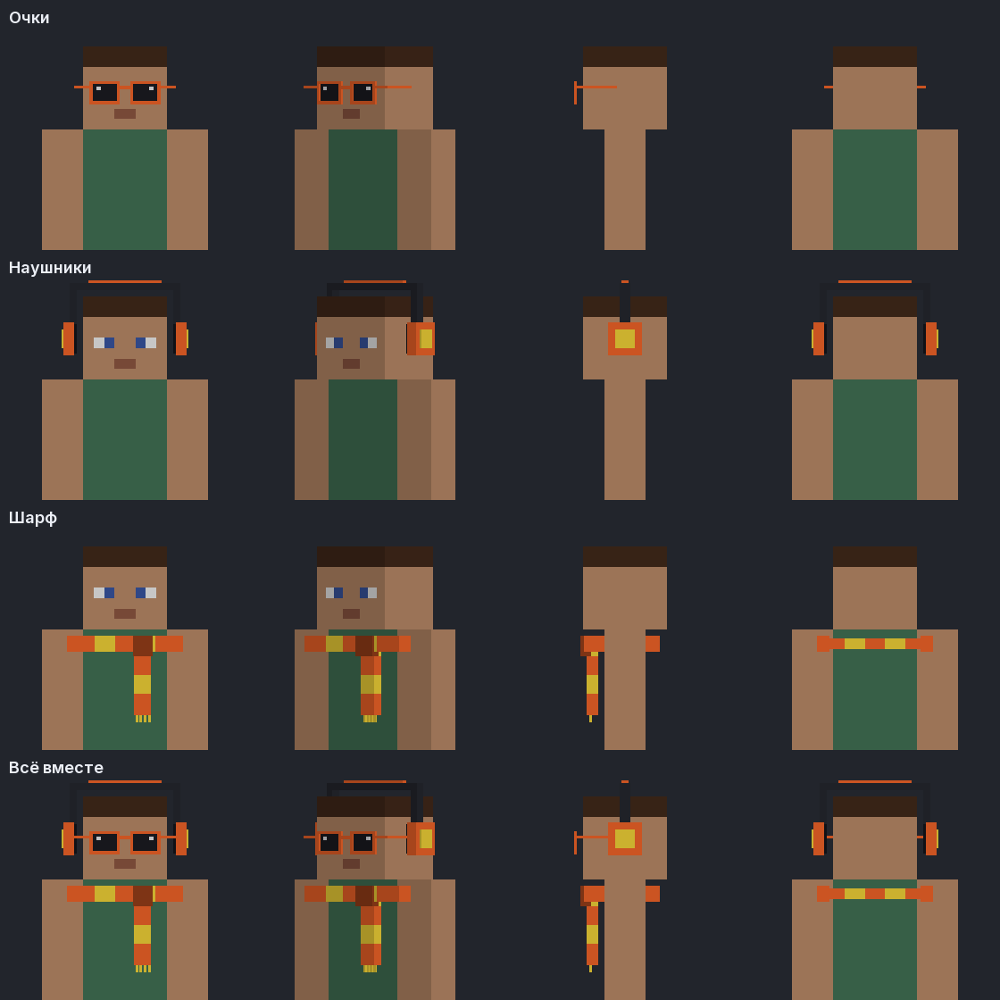
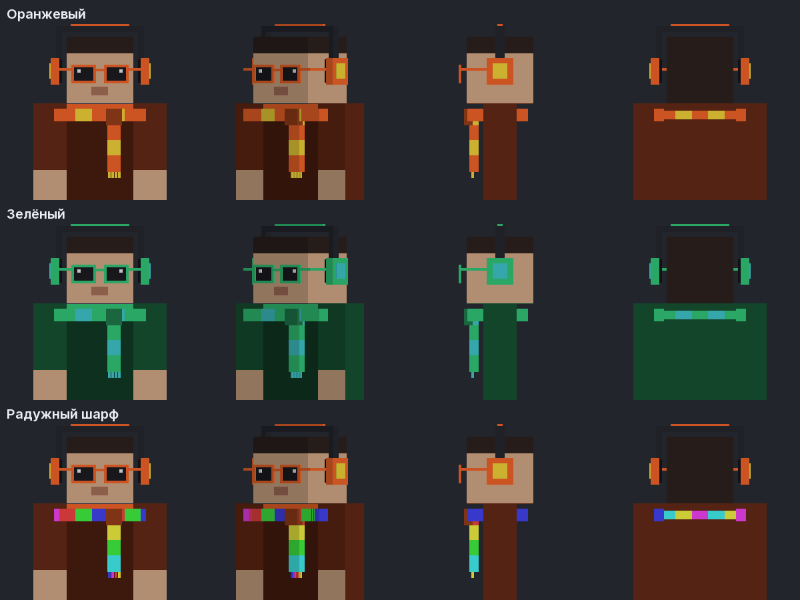

# LavaVisual для Bedrock

Расширение для [Geyser](https://geysermc.org). С ним игроки Bedrock видят **аксессуары** Java-игроков с LavaVisual:
очки, наушники и шарф — в том цвете, который игрок выбрал в моде. Радужный цвет показывается радужными полосками на
шарфе.

Это отдельная часть проекта, от Java-мода её сборка и версии не зависят.

Чтобы всё работало, на сервер ставятся **две вещи**:

| Файл | Куда | Зачем |
| --- | --- | --- |
| [LavaVisual-Bedrock-1.1.0.jar](../artifacts/bedrock/LavaVisual-Bedrock-1.1.0.jar) | папка `extensions` у Geyser | узнаёт, кто из Java-игроков что носит, и красит скины |
| [LavaVisual-Bedrock-Pack-1.0.0.mcpack](../artifacts/bedrock/LavaVisual-Bedrock-Pack-1.0.0.mcpack) | папка `packs` у Geyser | модель с аксессуарами, которую Geyser сам раздаёт телефонам |

Пак **обязателен**: без него Bedrock рисует обычного человечка и аксессуарам не на чем появиться.



## Что нужно

- Сервер, на который Bedrock-игроки заходят через **Geyser 2.11 или новее** (Paper/Spigot, Velocity, BungeeCord,
  Fabric/NeoForge-сервер или Geyser Standalone).
- Bedrock **26.0–26.40**. Эти версии поддерживает текущий Geyser, само расширение от версии Bedrock не зависит.
- У Java-игроков — LavaVisual (1.0.0 или новее) с включёнными аксессуарами.

На Java-сервер ничего ставить не нужно. Bedrock-игрокам тоже ничего не нужно: ни ресурс-пака, ни аддона.

## Установка

1. Скачайте [LavaVisual-Bedrock-1.1.0.jar](../artifacts/bedrock/LavaVisual-Bedrock-1.1.0.jar).
2. Положите файл в папку `extensions` у Geyser:

   | Где стоит Geyser | Папка |
   | --- | --- |
   | Paper / Spigot | `plugins/Geyser-Spigot/extensions/` |
   | Velocity | `plugins/Geyser-Velocity/extensions/` |
   | BungeeCord | `plugins/Geyser-BungeeCord/extensions/` |
   | Fabric / NeoForge | `config/Geyser-Fabric/extensions/` или `config/Geyser-NeoForge/extensions/` |
   | Geyser Standalone | `extensions/` рядом с jar |

3. Перезапустите сервер (или Geyser). В консоли появится строка
   `LavaVisual Bedrock ready: 22 accessory geometries ...`.

Настроек нет.

## Как это работает

Мод LavaVisual и так сообщает другим игрокам, что надето на его игроке: через незаметный бит в настройках скина,
который сервер пересылает всем. Поэтому аксессуары видны без серверного мода. Geyser получает этот бит для каждого
игрока, которого видит Bedrock-игрок. Расширение его расшифровывает и отправляет скин этого игрока на Bedrock вместе с
моделью аксессуаров.

- Аксессуары появляются примерно через 15–30 секунд после того, как Bedrock-игрок увидел Java-игрока или Java-игрок
  сменил аксессуар. Столько длится передача через бит скина.
- Скин самого игрока не меняется. Цвета аксессуаров записываются в угол текстуры, который модель игрока не использует.
- Работает и на пиратских серверах без скинов: тогда аксессуары надеваются на стандартный скин, который показывает
  Geyser.

## Ограничения

- Модель аксессуаров собрана из кубиков, как все Bedrock-скины. Физики (качания шарфа) на Bedrock нет.
- Шляпы, крылья и плащи на Bedrock пока не показываются, только аксессуары.
- Под шлемом очки и наушники прячутся в шлем.

## Для разработчика

```
python3 bedrock/tools/make_bedrock.py --preview preview.png   # модели аксессуаров и картинка с ними
bedrock/geyser-extension/gradlew -p bedrock/geyser-extension build
python3 bedrock/tools/geyser_smoke.py bedrock/geyser-extension/build/libs/LavaVisual-Bedrock-1.1.0.jar
```

- `tools/make_bedrock.py` пишет геометрию и проверяет, что каждый кубик лежит снаружи второго слоя скина.
- Тесты проверяют, что кадры мода расшифровываются через задержки сети, а у всех 22 моделей есть все кости игрока.
- CI (`.github/workflows/bedrock.yml`) собирает расширение, запускает его в последнем Geyser Standalone и выкладывает
  jar в `artifacts/bedrock/`.
- Код: `geyser-extension/src/main/java/tech/gulp/lavavisual/bedrock/`. Расшифровка кадров повторяет
  `effects/HatSync.java` из Java-мода.

## Пак для сервера (обязательно)

[LavaVisual-Bedrock-Pack-1.0.0.mcpack](../artifacts/bedrock/LavaVisual-Bedrock-Pack-1.0.0.mcpack) кладётся в папку
`packs` рядом с папкой `extensions` у Geyser:

| Где стоит Geyser | Папка |
| --- | --- |
| Paper / Spigot | `plugins/Geyser-Spigot/packs/` |
| Velocity | `plugins/Geyser-Velocity/packs/` |
| BungeeCord | `plugins/Geyser-BungeeCord/packs/` |
| Standalone | `packs/` рядом с jar |

Папку `packs` Geyser создаёт сам при первом запуске. После перезапуска сервера Bedrock-игрок при заходе один раз
скачает пак (несколько килобайт) — это обычная загрузка ресурс-пака, соглашаться в диалоге не нужно, Geyser
отправляет его автоматически.

Что делает пак: заменяет модель игрока (`geometry.humanoid.custom` и `customSlim`) на такую же модель плюс очки,
наушники и шарф. Цвет этих кубиков берётся из угла 8×8 текстуры скина, который у обычных скинов пустой, поэтому
игроки без LavaVisual выглядят точно так же, как раньше, и ничего лишнего у них не появляется.

## Готовый пак скинов (.mcpack)

Для самих Bedrock-игроков: [LavaVisual-Skins-1.0.0.mcpack](../artifacts/bedrock/LavaVisual-Skins-1.0.0.mcpack) —
18 скинов с аксессуарами LavaVisual, ничего больше ставить не нужно.



1. Скачайте файл на телефон или ПК.
2. Откройте его — Minecraft сам импортирует пак (на Android: «Открыть с помощью» → Minecraft).
3. В игре: **Профиль → Внешний вид → Классические скины → LavaVisual** и выберите нужный.

Что внутри: очки, наушники и шарф в пяти цветах, радужный шарф, а также варианты «только очки», «только наушники» и
«только шарф» — каждый в обычном варианте и с тонкими руками (как у Alex). Всего 18 скинов.

Ограничения: это пак скинов, поэтому меняется весь скин целиком — свой рисунок он не сохраняет. Чтобы надеть
аксессуары **на свой скин**, используйте приложение [LavaVisual для Android](../bedrock-app/README.md): оно собирает
такой же пак из вашего файла скина.

Пересобрать пак: `python3 bedrock/tools/make_mcpack.py` (нужны pillow и numpy). Скрипт сам проверяет, что каждый скин
ссылается на существующую текстуру 64×64 и на существующую геометрию.
